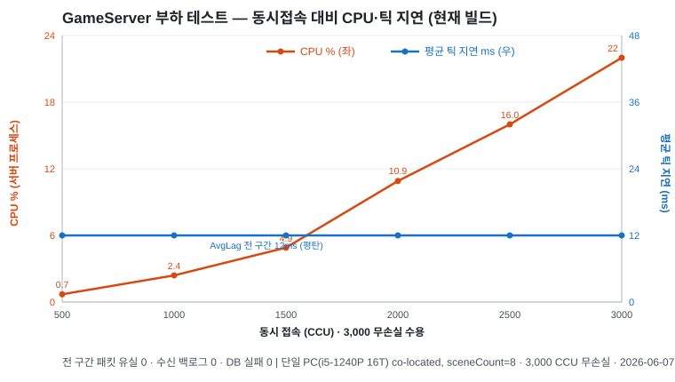
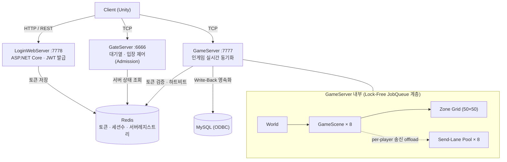

# C++ IOCP 대규모 멀티플레이 게임 서버

> Windows **IOCP** 비동기 네트워크와 **Lock-Free JobQueue**(액터 모델)로 구현한 MMO형 게임 서버.
> 단일 PC에서 **3,000 동시접속(CCU)** 을 안정적으로 수용하며, 부하 테스트로 병목을 측정·개선한 과정을 기록했습니다.


▶ **[시연 영상 (YouTube)](https://youtu.be/dGX39CQrB1o)** &nbsp;|&nbsp; 📑 [아키텍처 상세](CODEFLOW.md) &nbsp;|&nbsp; 🔧 [AOI 최적화 파이프라인](AOI_MOVEMENT_PIPELINE.md) &nbsp;|&nbsp; 📈 [부하 테스트 리포트](docs/loadtest-report.md) &nbsp;|&nbsp; 🐞 [트러블슈팅](docs/troubleshooting.md)

<!-- TODO: 아래에 게임플레이 GIF / 부하테스트 대시보드 GIF 2개 삽입 권장
     - 영상에서 5~8초 구간을 GIF로 추출해 docs/ 에 저장 후 아래처럼 임베드:
       
       
     - 채용담당자가 가장 먼저 보는 영역이므로 GIF 2장이 README 설득력을 크게 좌우함 -->

---

## 📊 핵심 성과 (실측)

> 단일 PC(Intel i5-1240P, 12C/16T, 16GB), localhost. Login·Gate·Game·부하기를 **한 머신에 동시 구동**한 보수적 환경.
> DummyClient로 0→3,000명까지 단계적 ramp-up 후 steady-state 측정. 원본 데이터·방법론: [`docs/loadtest-report.md`](docs/loadtest-report.md), [`docs/tick-performance-analysis.md`](docs/tick-performance-analysis.md).

**① 브로드캐스트 병목 최적화 — Before/After** *(초기 빌드: sceneCount=4, 동일 2,000 CCU, 틱 목표 80/s)*

| 지표 | Before (단일 Job 직렬 전송) | After (zone별 send-lane 병렬화) | 효과 |
|---|---|---|---|
| 평균 틱 지연 (AvgLag) | 44 ~ 110 ms | **15 ~ 54 ms** | 약 2~4배 ↓ |
| 최악 틱 지연 (MaxLag) | 356 ~ **1,606 ms** | **59 ~ 482 ms** | 1.6초 → 0.5초 이하 |
| Scene 틱레이트 | 28 ~ 46 /s | **43 ~ 61 /s** | 목표(80) 근접 |
| CPU 활용 (16코어) | 17 ~ 21% (노는 코어 다수) | **26 ~ 39%** | 유휴 워커 활용 |

> 핵심 발견: 2,000명에서 CPU가 21%에 불과한데 틱이 1.6초까지 밀렸다 → **CPU 부족이 아니라 "브로드캐스트 단일 Job이 워커 1개를 독점"하는 구조 병목**임을 측정으로 규명하고, zone별 송신을 send-lane 풀로 병렬화해 해결. ([상세](docs/troubleshooting.md))

**② 현재 빌드 한계 측정** *(sceneCount=8 · HEARTBEAT 500ms, 0→3,000 CCU ramp)*

| 동시접속 | CPU (서버) | 메모리 | 평균 틱 지연 | 합산 처리량 (In+Out) | 패킷 유실 |
|---|---|---|---|---|---|
| 2,000 CCU | 30 % | 0.6 GB | 14.5 ms | ~37k pkt/s | **0** |
| **~2,954 CCU** (피크) | 53 % | 0.7 GB | 17 ms | **~55k pkt/s (out 28.8 MB/s)** | **0** |

> 4종 프로세스를 한 PC에 올린 보수적 환경에서 **~2,950 CCU를 패킷 유실 0 · 수신 백로그 0 · DB 실패 0**으로 수용.
> 한계 요인을 **브로드캐스트(아웃바운드) 바운드**(품질 무릎 ~2,500)로 데이터로 특정했고, 인바운드 감소는 동일 PC **부하 생성기 한계**와 구분해 기록. → [측정 리포트](docs/loadtest-report.md)



> CPU는 동접에 거의 선형, 평균 틱 지연은 ~2,000까지 평탄하다 ~2,500부터 상승(브로드캐스트 압박). 메모리는 0.5→0.7GB로 평탄.

---

## 🏗️ 아키텍처

상용 게임 다수가 채택하는 **하이브리드 구조**: 인증/계정은 웹(HTTP), 실시간 인게임은 소켓(TCP), 그 사이를 Redis가 잇습니다.



**데이터 흐름:** 로그인(웹·JWT) → Redis 토큰 저장 → GateServer 대기열 입장(초당 배치 admission) → GameServer 접속 시 Redis 토큰 검증 → Zone 기반 AOI 동기화 → 변경분만 Write-Back으로 MySQL 저장.

---

## 🔑 핵심 기술

- **IOCP 비동기 네트워크** — `AcceptEx` 선발급(acceptPool 256), Worker Thread 기반 Recv/Send, 부분 패킷 누적 처리 · [`ServerCore/IocpCore.h`](ServerCore/IocpCore.h)
- **Lock-Free JobQueue (액터 모델)** — Zone/Scene당 **한 번에 한 스레드만 점유** → 락 없이 데드락 원천 차단 · [`ServerCore/JobQueue.h`](ServerCore/JobQueue.h)
- **Zone 기반 AOI** — 3×3 인접 존 시야, O(N²) 방어 · 틱 배칭 · 격자 직렬화 공유 (단계별 최적화: [`AOI_MOVEMENT_PIPELINE.md`](AOI_MOVEMENT_PIPELINE.md))
- **Send-Lane 브로드캐스트 병렬화** — scene 스레드는 직렬화만, per-player 전송은 8개 lane으로 offload (zone 순서 보존) · [`GameServer/GameScene.cpp`](GameServer/GameScene.cpp)
- **SendBuffer 풀링 & 모아쏘기** — 패킷마다 `WSASend` 대신 TLS 청크 풀에서 할당, 프레임별 일괄 flush · [`ServerCore/SendBuffer.cpp`](ServerCore/SendBuffer.cpp)
- **Write-Back DB 영속화** — 이동마다 UPDATE 금지, 메모리 누적 후 레벨업/로그아웃 시점에만 비동기 저장 (ODBC 커넥션 풀)
- **대기열 입장 제어(Admission)** — GateServer가 초당 배치로 공정 입장시켜 spawn 폭주 방지 · [`GateServer/QueueManager.cpp`](GateServer/QueueManager.cpp)
- **Protobuf 직렬화 + 실시간 모니터링 패널** — Network/Job/IOCP/Memory/DB/Game 지표 콘솔 오버레이 · [`ServerCore/ServerStats.cpp`](ServerCore/ServerStats.cpp)
- **몬스터 AI** — Recast/Detour NavMesh 경로탐색, Idle/Moving/Attack/Dead FSM, cross-scene 타겟 탐색
- **이동 검증(anti-cheat)** — 서버가 격자 walkability·속도 게이트로 클라 무결성 독립 검증, 패킷 rate-limit

---

## 🔧 트러블슈팅 하이라이트

| 문제 | 원인 | 해결 | 결과 |
|---|---|---|---|
| 2,000명에서 한 틱 최대 1.6초 지연 | 브로드캐스트가 scene 단일 Job으로 워커 1개 독점 | zone별 send-lane 8개로 전송 offload·병렬화 | MaxLag 1.6s→0.5s 이하, **3,000명까지 확장** ([분석](docs/tick-performance-analysis.md)) |
| 고부하 시 `WSASend` 실패(WSAENOBUFS/10055) | 패킷마다 버퍼 할당 → 버퍼 고갈 | SendBuffer 청크 풀링 + 프레임별 모아쏘기 | 3,000명 안정 송신 |
| Scene 경계 통과 시 이동 정지 / cross-scene 크래시 | 씬 교체 타이밍 race로 패킷 라우팅 실패 | `DoAsync`로 신규 존 Enter 완료 후 교체 | 무손실 핸드오프 |

---

## 🛠️ 기술 스택

| 구분 | 기술 |
|---|---|
| Server | C++17, Windows IOCP, Google Protobuf, MySQL(ODBC), Redis(hiredis), Recast/Detour |
| Web | ASP.NET Core, Entity Framework, JWT |
| Client | Unity (C#), protobuf-net |
| 패턴 | IOCP Proactor, Lock-Free JobQueue(Actor), Object/Memory Pool + TLS, Zone AOI, Write-Back |
| 부하테스트 | DummyClient(3,000 동접) + ramp 드라이버·로그 파서(로컬 하네스) |

**구성 (`GameServer/server.json`):** maxSessions 3,000 · sceneCount 8 · zoneSize 20 · updateTickMs 50 · DB threads 2

---

## ▶ 빌드 & 실행

```text
1. Visual Studio 2022 / Windows SDK / C++17
2. 외부 라이브러리 헤더를 Libraries/Include/ 에 배치 (아래 표)
3. Server.sln 빌드 (x64 Release)
4. 사전 구동: Redis(:6379), MySQL(:3306, DB명 portfolio)
5. 실행 순서: LoginWebServer → GameServer → (GateServer) → Client/DummyClient
```

부하 테스트 재현 방법과 측정 결과는 [`docs/loadtest-report.md`](docs/loadtest-report.md) 참고 (드라이버/파서 하네스는 로컬 전용).

### 외부 라이브러리 (별도 설치)

| 라이브러리 | 용도 | 링크 |
|---|---|---|
| Google Protobuf | 패킷 직렬화 | https://github.com/protocolbuffers/protobuf |
| hiredis | Redis 클라이언트 | https://github.com/redis/hiredis |
| MySQL ODBC | DB 연결 | https://dev.mysql.com/downloads/connector/odbc/ |
| Recast/Detour | NavMesh 경로탐색 | https://github.com/recastnavigation/recastnavigation |

---

## 📂 코드 리딩 가이드 (여기부터 보세요)

| 관심사 | 핵심 파일 |
|---|---|
| 동시성 모델의 핵심 | [`ServerCore/JobQueue.h`](ServerCore/JobQueue.h) — zone당 단일 스레드 직렬화 보장 |
| IOCP 이벤트 루프 | [`ServerCore/IocpCore.h`](ServerCore/IocpCore.h), [`ServerCore/SendBuffer.cpp`](ServerCore/SendBuffer.cpp) |
| 게임 틱 · 브로드캐스트 병렬화 | [`GameServer/GameScene.cpp`](GameServer/GameScene.cpp) |
| AOI · 공간 분할 | [`GameServer/Zone.h`](GameServer/Zone.h) |
| 대기열 입장 제어 | [`GateServer/QueueManager.cpp`](GateServer/QueueManager.cpp) |
| 패킷 프로토콜 | [`Common/Protocol/Protocol.proto`](Common/Protocol/Protocol.proto) |
| 실시간 지표 패널 | [`ServerCore/ServerStats.cpp`](ServerCore/ServerStats.cpp) |

전체 코드 흐름은 [`CODEFLOW.md`](CODEFLOW.md), ServerCore 인프라는 [`SERVERCORE_GUIDE.md`](SERVERCORE_GUIDE.md) 참고.
